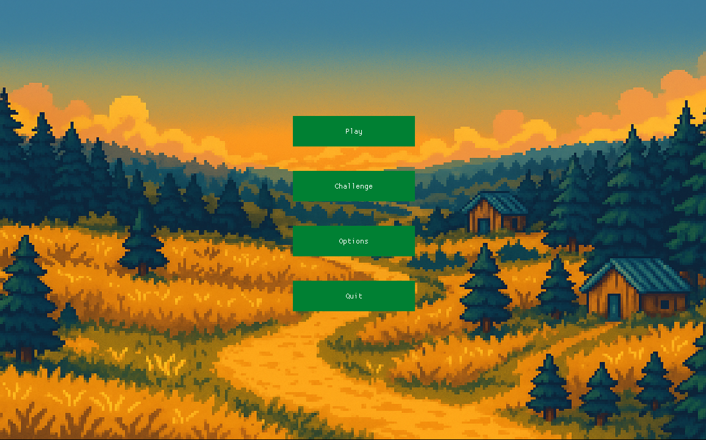
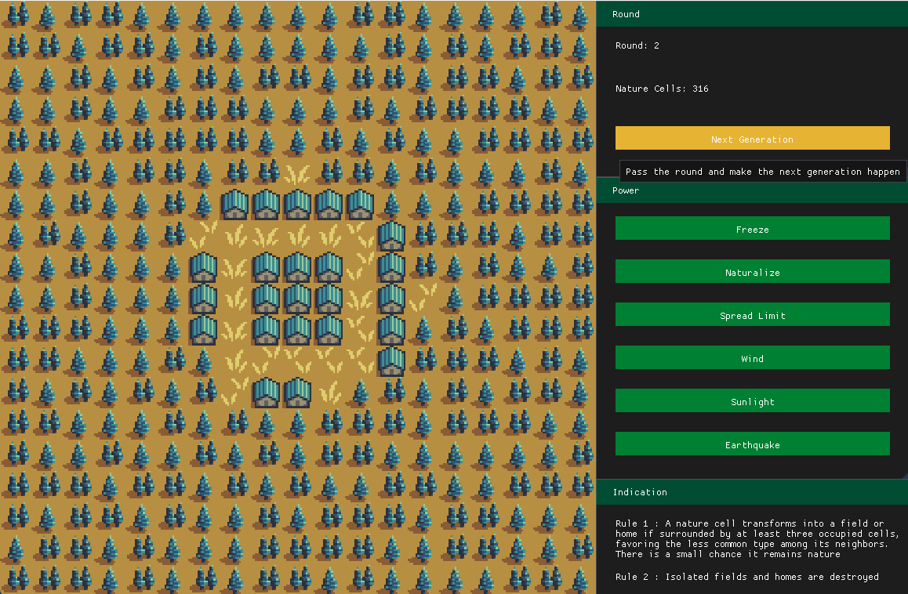

# JeuDeLaNature-Thibault-Yassin

## Description
Le Jeu de la Nature est un jeu de stratégie tour par tour dans lequel vous incarnez la Nature tentant de résister à l’expansion humaine.

Le plateau de jeu est une grille de 19x19 cases initialement recouverte de nature, sauf au centre où un carré 3x3 est occupé aléatoirement par des champs et maisons. À chaque tour, les constructions humaines se propagent selon des règles de voisinage, menaçant d’envahir tout l’environnement naturel.

Votre objectif est de conserver un maximum de cases naturelles à la fin de 25 tours. Pour cela, vous disposez de pouvoirs spéciaux (gel, retour à la nature, tremblement de terre, etc.) aux effets variés et soumis à des cooldowns. La stratégie réside dans l’utilisation judicieuse de ces pouvoirs pour ralentir ou perturber l’expansion humaine.

Le jeu met en lumière l'inéluctabilité de l'expansion humaine du fait de l'agriculture et la sédentarisation.

## Mode d'emploi
La prise en main du jeu est plutôt simple car tout ce fait à l'aide d'UI et de boutons (aucune touche n'est utilisé).

Il y a 2 modes de jeu :
- Play : jouer à une carte généré aléatoirement
- Challenge : jouer à une map prédéfinie

Une fois en jeu, il y a 3 sous-menu pour jouer au jeu :
- Round : Affiche les données du jeu + un bouton next generation pour aller à la génération suivante.
- Power : Survoler un pouvoir pour connaître son utilité. Appuyer dessus et sélectionner une case pour l'activer sur cette case.
- Indication : Donne des indications sur les règles de propagations

## Lancement du jeu
Pour lancer le jeu vous pouvez suivre cette procédure [Construire un projet C++ avec cmake](https://www-inf.telecom-sudparis.eu/COURS/CSC4526/new_site/Supports/Documents/OutilsCSC4526/outilsCSC4526.html#construire-un-projet-c-avec-cmake) et séléctionner comme élément de démarrage "main.exe"